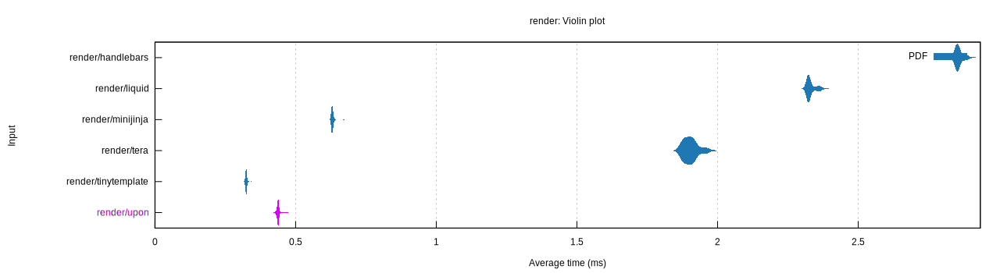

# upon

A simple, powerful template engine.

## Features

- Expressions: `{{ user.name }}`
- Conditionals: ` ... `
- Loops: ` ... `
- Customizable filter functions: `{{ user.name | lower }}`
- Customizable value formatters: `{{ user.name | escape_html }}`
- Configurable template syntax: `<? user.name ?>`, `(( if user.enabled ))`
- Render using any `serde` serializable values
- Render using a quick context with a convenient macro:
  `upon::value!{ name: "John", age: 42 }`
- Render to any `std::io::Write` implementor
- Minimal dependencies

### Still to come...

- Filters with arguments
- Fallible filters
- "No `serde`" support

## Getting started

Your entry point is the compilation and rendering `Engine`, this stores the
syntax config and filter functions. Generally, you only need to construct one
engine during the lifetime of a program.

```rust
let engine = upon::Engine::new();
```

Compiling a template returns a handle bound to the lifetime of the engine and
the template source.

```rust
let template = engine.compile("Hello {{ user.name }}!")?;
```

The template can then be rendered by calling `.render()`.

```rust
let result = template.render(upon::value!{ user: { name: "John Smith" }})?;
assert_eq!(result, "Hello John Smith!");
```

You can also use `add_template(name, ...)` and to store a template in the
engine.

```rust
engine.add_template("hello", "Hello {{ user.name }}!")?;
```

Then later fetch it by name using `get_template(name)`.

```rust
let result = engine.get_template("hello").unwrap()
    .render(upon::value!{ user: { name: "John Smith" }})?;
assert_eq!(result, "Hello John Smith!");
```

## Examples

See more in the [docs](https://docs.rs/upon/latest/upon/#examples).

## Benchmarks

The following shows a violin plot of the benchmark results for `upon` compared
to the following template rendering engines.
- [handlebars](https://crates.io/crates/handlebars)
- [minijinja](https://crates.io/crates/minijinja)
- [tera](https://crates.io/crates/tera)
- [tinytemplate](https://crates.io/crates/tinytemplate)

Obviously, each of these engines has a completely different feature set so this
just compares the performance for some of the features that `upon` supports.



**Host**
- MacBook Pro (14-inch, 2021)
- Chipset: Apple M1 Pro
- Memory: 16 GB

## License

Licensed under either of

- Apache License, Version 2.0 ([LICENSE-APACHE](LICENSE-APACHE) or
  http://www.apache.org/licenses/LICENSE-2.0)
- MIT license ([LICENSE-MIT](LICENSE-MIT) or http://opensource.org/licenses/MIT)

at your option.
