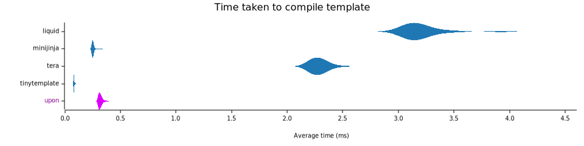
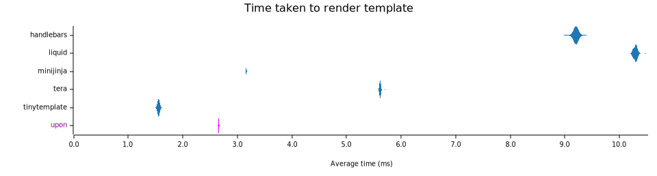
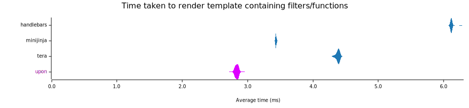

<!-- Generated by cargo-onedoc. DO NOT EDIT. -->

# upon

[](https://crates.io/crates/upon)
[](https://docs.rs/upon)
[](https://github.com/rossmacarthur/upon/actions/workflows/build.yaml?query=branch%3Atrunk)

A simple, powerful template engine with minimal dependencies and
configurable delimiters.

## Table of Contents

- [Overview](#overview)
  - [Syntax](#syntax)
  - [Engine](#engine)
  - [Why another template engine?](#why-another-template-engine)
  - [MSRV](#msrv)
- [Getting started](#getting-started)
- [Further reading](#further-reading)
- [Features](#features)
- [Examples](#examples)
  - [Nested templates](#nested-templates)
  - [Render to writer](#render-to-writer)
  - [Borrowed templates with short lifetimes](#borrowed-templates-with-short-lifetimes)
  - [Custom template store and function](#custom-template-store-and-function)
- [Benchmarks](#benchmarks)
- [License](#license)

## Overview

### Syntax

- Expressions: `{{ user.name }}`
- Conditionals: ` ... `
- Loops: ` ... `
- Nested templates: ``
- Configurable delimiters: `<? user.name ?>`, `(( if user.enabled ))`
- Arbitrary user defined filters: `{{ user.name | replace: "\t", " " }}`

### Engine

- Clear and well documented API
- Customizable value formatters: `{{ user.name | escape_html }}`
- Render to a [`String`][string] or any [`std::io::Write`][stdiowrite] implementor
- Render using any [`serde`][serde] serializable values
- Convenient macro for quick rendering:
  `upon::value!{ name: "John", age: 42 }`
- Pretty error messages when displayed using `{:#}`
- Format agnostic (does *not* escape values for HTML by default)
- Minimal dependencies and decent runtime performance

### Why another template engine?

It’s true there are already a lot of template engines for Rust!

I created `upon` because I required a template engine that had runtime
compiled templates, configurable syntax delimiters and minimal dependencies.
I also didn’t need support for arbitrary expressions in the template syntax
but occasionally I needed something more flexible than outputting simple
values (hence filters). Performance was also a concern for me, template
engines like [Handlebars] and [Tera] have a lot of features but can be up to
five to seven times slower to render than engines like [TinyTemplate].

Basically I wanted something like [TinyTemplate] with support for
configurable delimiters and user defined filter functions. The syntax is
inspired by template engines like [Liquid] and [Jinja].

### MSRV

Currently the minimum supported version for `upon` is Rust 1.65. Disabling
the **`filters`** feature reduces it to Rust 1.60. The MSRV will only ever
be increased in a breaking release.

## Getting started

First, add the crate to your Cargo manifest.

```sh
cargo add upon
```

Now construct an [`Engine`][engine]. The engine stores the syntax config, filter
functions, formatters, and compiled templates. Generally, you only need to
construct one engine during the lifetime of a program.

```rust
let engine = upon::Engine::new();
```

Next, [`add_template(..)`][add_template] is used to compile and store a
template in the engine.

```rust
engine.add_template("hello", "Hello {{ user.name }}!")?;
```

Finally, the template is rendered by fetching it using
[`template(..)`][template], calling
[`render(..)`][render] and rendering to a string.

```rust
let result = engine
    .template("hello")
    .render(upon::value!{ user: { name: "John Smith" }})
    .to_string()?;
assert_eq!(result, "Hello John Smith!");
```

## Further reading

- The [`syntax`][syntax] module documentation outlines the template syntax.
- The [`filters`][filters] module documentation describes filters and how they work.
- The [`fmt`][fmt] module documentation contains information on value formatters.
- In addition to the examples in the current document, the
  [`examples/`](https://github.com/rossmacarthur/upon/tree/trunk/examples) directory in the repository constains some more
  concrete code examples.

## Features

The following crate features are available.

- **`filters`** *(enabled by default)* — Enables support for filters in
  templates (see [`Engine::add_filter`][engineadd_filter]). This does *not* affect value
  formatters (see [`Engine::add_formatter`][engineadd_formatter]). Disabling this will improve
  compile times.

- **`serde`** *(enabled by default)* — Enables all serde support and pulls
  in the [`serde`][serde] crate as a dependency. If disabled then you can use
  [`render_from(..)`][render_from] to render templates and
  construct the context using [`Value`][value]’s `From` impls.

- **`unicode`** *(enabled by default)* — Enables unicode support and pulls
  in the [`unicode-ident`][unicode-ident] and
  [`unicode-width`][unicode-width] crates. If disabled then unicode
  identifiers will no longer be allowed in templates and `.chars().count()`
  will be used in error formatting.

To disable all features or to use a subset you need to set `default-features = false` in your Cargo manifest and then enable the features that you would
like. For example to use **`serde`** but disable **`filters`** and
**`unicode`** you would do the following.

```toml
[dependencies]
upon = { version = "...", default-features = false, features = ["serde"] }
```

## Examples

### Nested templates

You can include other templates by name using ``.

```rust
let mut engine = upon::Engine::new();
engine.add_template("hello", "Hello {{ user.name }}!")?;
engine.add_template("goodbye", "Goodbye {{ user.name }}!")?;
engine.add_template("nested", "\n")?;

let result = engine.template("nested")
    .render(upon::value!{ user: { name: "John Smith" }})
    .to_string()?;
assert_eq!(result, "Hello John Smith!\nGoodbye John Smith!");
```

### Render to writer

Instead of rendering to a string it is possible to render the template to
any [`std::io::Write`][stdiowrite] implementor using
[`to_writer(..)`][to_writer].

```rust
use std::io;

let mut engine = upon::Engine::new();
engine.add_template("hello", "Hello {{ user.name }}!")?;

let mut stdout = io::BufWriter::new(io::stdout());
engine
    .template("hello")
    .render(upon::value!{ user: { name: "John Smith" }})
    .to_writer(&mut stdout)?;
// Prints: Hello John Smith!
```

### Borrowed templates with short lifetimes

If the lifetime of the template source is shorter than the engine lifetime
or you don’t need to store the compiled template then you can also use the
[`compile(..)`][compile] function to return the template directly.

```rust
let template = engine.compile("Hello {{ user.name }}!")?;
let result = template
    .render(&engine, upon::value!{ user: { name: "John Smith" }})
    .to_string()?;
assert_eq!(result, "Hello John Smith!");
```

### Custom template store and function

The [`compile(..)`][compile] function can also be used in
conjunction with a custom template store which can allow for more advanced
use cases. For example: relative template paths or controlling template
access.

```rust
let mut store = std::collections::HashMap::<&str, upon::Template>::new();
store.insert("hello", engine.compile("Hello {{ user.name }}!")?);
store.insert("goodbye", engine.compile("Goodbye {{ user.name }}!")?);
store.insert("nested", engine.compile("\n")?);

let result = store.get("nested")
    .unwrap()
    .render(&engine, upon::value!{ user: { name: "John Smith" }})
    .with_template_fn(|name| {
        store
            .get(name)
            .ok_or_else(|| String::from("template not found"))
    })
    .to_string()?;
assert_eq!(result, "Hello John Smith!\nGoodbye John Smith!");
```

[Handlebars]: https://crates.io/crates/handlebars
[Tera]: https://crates.io/crates/tera
[TinyTemplate]: https://crates.io/crates/tinytemplate
[Liquid]: https://liquidjs.com
[Jinja]: https://jinja.palletsprojects.com

## Benchmarks

`upon` was benchmarked against several popular template rendering engines in the
Rust ecosystem. Obviously, each of these engines has a completely different
feature set so the benchmark just compares the performance of some of the
features that they share.

- [handlebars](https://crates.io/crates/handlebars) v4.3.7
- [liquid](https://crates.io/crates/liquid) v0.26.4
- [minijinja](https://crates.io/crates/minijinja) v1.0.5
- [tera](https://crates.io/crates/tera) v1.19.0
- [tinytemplate](https://crates.io/crates/tinytemplate) v1.2.1
- upon v0.7.0





Benchmarking was done using [criterion](https://crates.io/crates/criterion) on
a quiet cloud machine.

**Host**

- Vultr.com
- 4 CPU
- 8192 MB RAM
- Ubuntu 22.04
- Rust 1.71.0

## License

Licensed under either of

- Apache License, Version 2.0 ([LICENSE-APACHE](LICENSE-APACHE) or
  http://www.apache.org/licenses/LICENSE-2.0)
- MIT license ([LICENSE-MIT](LICENSE-MIT) or http://opensource.org/licenses/MIT)

at your option.


[add_template]: https://docs.rs/upon/latest/upon/struct.Engine.html#method.add_template
[compile]: https://docs.rs/upon/latest/upon/struct.Engine.html#method.compile
[engine]: https://docs.rs/upon/latest/upon/struct.Engine.html
[engineadd_filter]: https://docs.rs/upon/latest/upon/struct.Engine.html#method.add_filter
[engineadd_formatter]: https://docs.rs/upon/latest/upon/struct.Engine.html#method.add_formatter
[filters]: https://docs.rs/upon/latest/upon/filters/index.html
[fmt]: https://docs.rs/upon/latest/upon/fmt/index.html
[render]: https://docs.rs/upon/latest/upon/struct.TemplateRef.html#method.render
[render_from]: https://docs.rs/upon/latest/upon/struct.TemplateRef.html#method.render_from
[serde]: https://crates.io/crates/serde
[stdiowrite]: https://doc.rust-lang.org/stable/std/io/trait.Write.html
[string]: https://doc.rust-lang.org/stable/std/string/struct.String.html
[syntax]: ./SYNTAX.md
[template]: https://docs.rs/upon/latest/upon/struct.Engine.html#method.template
[to_writer]: https://docs.rs/upon/latest/upon/struct.TemplateRef.html#method.to_writer
[unicode-ident]: https://crates.io/crates/unicode-ident
[unicode-width]: https://crates.io/crates/unicode-width
[value]: https://docs.rs/upon/latest/upon/enum.Value.html
